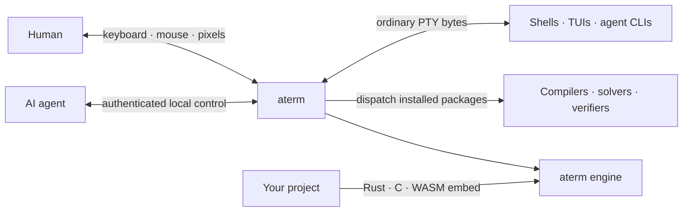

<!-- SPDX-License-Identifier: Apache-2.0 -->
<!-- Copyright 2026 Andrew Yates -->

<h1 align="center">aterm</h1>

<p align="center">
  <strong>The batteries-included terminal for AI.</strong><br>
  A real GPU terminal for people, an authenticated control surface for agents,
  the ALab verification toolchain one command away — and a cat.
</p>

<p align="center">
  <a href="https://github.com/alabsystems/aterm/releases"></a>
  <a href="LICENSE"></a>
</p>

<p align="center">
  <a href="#install">Install</a> ·
  <a href="#why-aterm">Why aterm?</a> ·
  <a href="#made-for-humans-and-agents">Humans + agents</a> ·
  <a href="#fun-is-a-feature">Fun</a> ·
  <a href="#the-alab-toolchain">Toolchain</a> ·
  <a href="#use-aterm-in-your-own-project">Embed it</a> ·
  <a href="#security-model">Security</a>
</p>

<p align="center">
  <picture>
    <source media="(prefers-reduced-motion: reduce)" srcset="assets/aterm-ai-workbench.png">
    
  </picture>
  <br><sub>Captured by aterm itself — <code>aterm ctl window</code> and <code>aterm ctl video</code>.</sub>
</p>

## Install

aterm ships for macOS 11+ as a signed, notarized universal app (Apple silicon
and Intel) from the public release channel at
[github.com/alabsystems/aterm/releases](https://github.com/alabsystems/aterm/releases).
Either download the newest `vX.Y.0` DMG and drag `aterm.app` into
Applications, or let the installer do it:

```sh
curl -fsSL https://raw.githubusercontent.com/alabsystems/aterm/HEAD/tools/install.sh | bash
```

The script picks the newest release, checks the DMG's SHA-256 against the
release manifest, verifies the app's Developer ID signature and notarization,
puts `aterm.app` in `/Applications` (or `~/Applications`), and links one
`aterm` command into `~/.local/bin`. If `gh` is logged in it also stashes that
token for the updater's private-repo lane (`--no-token` skips this; the public
channel needs no token). Run it again with `--uninstall` to reverse everything
it installed.

Installing by hand does the same checks manually: compare the DMG's SHA-256
with the digest in that release's `aterm-appcast.toml`, then, with the app in
place, run `codesign --verify --strict --verbose=2 /Applications/aterm.app` and
`spctl -a -t exec -vv /Applications/aterm.app` — the second must report
`source=Notarized Developer ID`.

### Staying current

Installed copies keep themselves current: the app checks the release channel
in the background, verifies the new build, and swaps it in at a quiet moment —
every window, tab, split, and live shell survives, and if the handoff cannot
complete the update lands at the next launch. Settings ▸ Software Update shows
what is staged plus the release notes; `aterm ctl update status` says the same
on the command line. `ATERM_NO_AUTO_UPDATE=1` turns the updater off;
`[update] auto_apply = false` in `aterm.toml` stages the build and leaves
applying it to you (Software Update, `aterm ctl update apply`, or the next
launch).

### Build from source

This repository is a snapshot of the private development line, cut with each
release, and pins a stock Rust toolchain. On macOS with the Xcode Command Line
Tools installed:

```sh
git clone https://github.com/alabsystems/aterm.git
cd aterm
cargo build --locked -p aterm
./target/debug/aterm --window
```

`./target/debug/aterm --version` should agree with `[workspace.package]
version` in the root `Cargo.toml`. Build from the workspace: aterm's crates are not on crates.io,
and the crates.io package named `aterm` is an unrelated project, so do not
`cargo install aterm`. Linux and Windows build from source too and have
in-tree build lanes and tests, but only macOS has released binaries, an
installer, and the self-updater; a source build is a real aterm, not the
byte-identical notarized release.

## Why aterm?

Most terminals are excellent human interfaces. aterm keeps that familiar PTY
and adds a second, authenticated surface that software can understand: text,
styled cells, pixels, events, sessions, input, synchronization, and live
metrics.

That makes the terminal a shared workbench. A person types normally while an
agent observes structured state, drives a turn, waits for a real transition, or
captures the rendered result. Shells, TUIs, REPLs, editors, and agent CLIs still
see an ordinary terminal.



**And it is fun.** The window looks alive, and the cursor has a companion with
opinions about your typing. ALab, the group behind aterm, also ships its
compilers, solvers, and verification tools through it: one `aterm pkg install`
away.

| Battery | What aterm adds | Important boundary |
| --- | --- | --- |
| **Observe** | Plain text, lossless styled cells, cursor, modes, shell command blocks, session status, a lifecycle timeline, and full-history search | Window and headless modes only |
| **Drive** | Text, keys, paste, mouse, focus, resize, selection, clipboard, tabs, menu actions, and native Settings | Signals are a separate operation, never faked keystrokes |
| **Coordinate** | Event-driven `await`, `ready`, `wait`, whole-turn settlement, and cooperative drive leases | `turn` waits for the screen to settle, not for the process to exit; `wait` needs OSC 133 marks |
| **Stream** | `screen`, `cursor`, `cells`, `bytes`, `events`, and `sessions` subscriptions, plus fleet-wide NDJSON | Gaps are marked, never hidden |
| **Capture** | PNG frames, full-window artifacts with native chrome (macOS), bounded asciicast history, opt-in temporal replay, and GPU swapchain-tap video | Records what aterm rendered, not what the display showed |
| **Measure** | Live render, frame, input, and application-present-return counters with percentiles and startup phases | Software-side counters; GPU completion and the display are outside |
| **Extend** | Themes, typography, wallpaper, Trail Packs, Toy Packs, keybindings, and the Rust/C/WASM engine source | Path dependencies only — no crates.io, no API stability yet |
| **Delight** | The rainbow kitty pet, per-program cats, Robi the helper robot, a shelf of cursor trails, Sparkle Words, Matrix rain, and a typing-sound synth | Synth audio is macOS-only today; some halos need the GPU |

### One binary, distinct modes

aterm ships as one executable. Invocation chooses the surface:

| Invocation | Result | External control socket |
| --- | --- | --- |
| `aterm` in a TTY | Transparent PTY session | No |
| `aterm` with no TTY on stdin (a Finder launch) | Terminal window | Yes, by default |
| `aterm --window` | Terminal window, explicitly | Yes, by default |
| `aterm --headless` | Terminal engine without a window | Yes, by default |
| `aterm --session` | Force the PTY session in a pipe or CI | No |

The same binary handles `aterm ctl`, `aterm pkg`, `aterm fleet`, `aterm drive`,
`aterm agents`, `aterm help`, diagnostics, and managed-tool dispatch.
Compatibility names such as `aterm-ctl` and `atpkg` are symlinks to that
binary, not separate products, and the app bundle ships them beside it.

The plain TTY session deliberately serves no socket. Use window or headless mode
when another process needs to observe or drive a session. Those modes enable
control by default, can disable it explicitly (`--no-control-sock`), and fail
closed if a secure socket cannot be created.

## Made for humans and agents

aterm does not make an agent impersonate a person by scraping pixels and hoping
the timing works. Agents speak a local control protocol that lives outside the
PTY byte stream; the text and keys they send enter through the same input path a
person's keystrokes do, and the person's keyboard never routes through the
agent — so a human can type at any time, even in the middle of an agent's turn.

Coding agents learn that aterm exists once per machine:

```sh
aterm agents install
```

detects the coding agents on the machine — Claude Code, Codex CLI, Gemini CLI,
and OpenCode — and adds a short primer to each one's global context file
(`~/.claude/CLAUDE.md`, `~/.codex/AGENTS.md`, …; name an agent to force it).
The primer only activates when the agent finds itself inside aterm; Claude Code
also gets a bundled `drive-aterm` skill. An agent launched inside an aterm
window or headless instance then knows to detect it (`TERM_PROGRAM=aterm` /
`ATERM_CHILD=1`) and to run `aterm help`, which there prints the agent
operating brief with the caller's own session ID already filled in.
`aterm agents` shows status, `aterm agents remove` uninstalls, and
`aterm help agents` explains the mechanism.

Two facts agent builders ask about first:

- **Env hygiene is unconditional.** Every shell aterm spawns has `CLAUDE*`,
  `ANTHROPIC_*`, `COPILOT_*`, `CODEX_*`, `CURSOR_*`, `AI_*`, and `_DEVTOOL_*`
  stripped, along with aterm's own socket, containment, and network selectors,
  so an outer agent's context never leaks into an inner session.
- **There is no MCP server, by design.** The integration surfaces are the CLI
  (`aterm ctl`, `aterm drive`, `aterm fleet`) and the Rust library API.

Beyond the batteries listed under [Why aterm?](#why-aterm), the control-enabled
window and headless modes provide:

- **Session state without reading the screen:** a per-session `status`
  classification (idle / running / quiet / exited, with confidence), a
  `timeline` of lifecycle events, and user-settable `meta` such as a typed
  `role` and a needs-human `attention` flag.
- **Capture without a screenshot tool:** `image` captures the rendered client
  frame, `window` the whole window with its chrome, and `video` the frames
  aterm submitted. Process signals stay a separate, explicit operation.
- **Whole turns:** `turn` types, submits, verifies the submit landed, waits for
  the screen to settle, and returns the visible result plus a deterministic
  hash.
- **Event-driven synchronization:** `await`, `ready`, `wait`, and `subscribe`
  park on state changes rather than forcing a driver to poll. Timeouts exit
  with code 124 so scripts can tell "not yet" from "failed".
- **Session fabric:** stable session IDs, exact `@sid` routing across every
  same-user instance, `@self` for your own session, a hard per-session lease
  during a `turn` and a cooperative `lease` for raw drivers, multi-session
  subscriptions, and `aterm fleet events` / `aterm fleet exec` to federate a
  fleet over one descriptor.

### CLI tour

Open a window — with your shell, or running one command:

```sh
aterm --window
aterm --window -e htop        # -d <dir>, --hold, --shell pwsh also exist
```

From another shell, inspect and drive its active session:

```sh
aterm ctl text                  # plain visible rows
aterm ctl screen                # lossless styled-grid JSON
aterm ctl status                # phase, outcome, and confidence for this session
aterm ctl image frame.png       # a rendered PNG, written on the aterm host
aterm ctl image --bytes         # inline base64 PNG when the client is remote
aterm ctl turn 'git status'     # type, submit, settle, and return the screen
aterm ctl wait                  # block until the running command completes (OSC 133)
aterm ctl metrics               # live render and latency counters
```

A verb with no session address targets the active tab. From inside an aterm
session, `@self` is your own pane; for automation, pick a session by ID or mint
one:

```sh
aterm ctl ls                                   # every session of every live instance
sid=$(aterm ctl spawn | cut -d' ' -f2)         # a fresh tab, immediately addressable
aterm ctl "@$sid" turn 'make test'
aterm ctl "@$sid" await match 'result:'        # block until a regex appears (one token)
aterm ctl subscribe "@$sid" events,cursor      # targets follow the verb here; add screen,cells,bytes as needed
aterm ctl "@$sid" close
```

`await` takes one of four predicates — `idle <ms>`, `seq [<n>]`, `match <re>`,
`block` — with an optional `timeout=<ms>`; `await seq` is level-triggered, so
`await seq <n> timeout=0` is a cheap one-shot "did anything change?" check.
Socket discovery is automatic for ordinary local use: `--sock`, `--pid`,
`$ATERM_CONTROL_SOCK`, then the instance hosting your own terminal, then the
per-user socket that always points at the newest instance. `aterm ctl help`
prints the live verb catalog from a running instance; `aterm help introspection`
prints the same catalog anywhere. Both are generated from the one typed verb
table the server answers from, so they cannot drift.

## Fun is a feature

The default cursor is the **rainbow kitty pet**: a full-body cat that walks,
runs, and pounces along your line, trailing a banded rainbow ribbon (with a
glass-bell typing sound on macOS). It cheers a green build, sulks at a failed
one, and chases your mouse. A new kitty is generated every time aterm starts,
and any program that holds the foreground for more than a few seconds earns its
own cat — Claude Code, Codex, and everything else you run gets a look of its
own. View ▸ Favourite This Kitty pins the one you like.

<p align="center">
  
</p>

Switch the cursor to `rainbow kitty` (the ribbon with the original flying cat
instead of the walker), the `rainbow dog pet`, `phaser`, `comet`, `lumen`,
`sparkle`, `fire`, `laser`, `water`, or `beam`, or load a Trail Pack — a TOML
cursor trail, no restart needed, composed from the built-in beam, crown,
particle, and ramp primitives. Every trail has a signature typing sound on
macOS, and Settings ▸ Cursor & Motion ▸ Sound lets you pick any instrument from
glass bell and droplet to typewriter, marimba, and felt regardless of the trail
on screen — or leave it on `auto` to follow the trail.

The rest of the roster:

- **Robi**, a tip-sharing helper robot, walks your typed row, does jumping
  jacks while showing tips, and swings across the tab bar. Type `robi` and he
  hustles over with a fresh tip; click him to retire him (he stays gone until
  you re-enable `robi` in Settings).
- **Sparkle Words** give typed words animated ink. Profanity gets rainbow ink
  with a bonk (and sometimes escalates to a nova); dozens of animal words — in
  English, Chinese, Japanese, Korean, and more — show their animal on the word;
  `kitty` summons a cat, and `dog`, once you have typed enough, summons a dog.
  Toy Packs add your own word effects from TOML. Everything is purely visual:
  copied text, logs, and recordings read exact bytes.
- **Matrix rain** falls only in empty cells under the text, follows what the
  session is doing, and toggles per session from View ▸ Matrix Rain or
  `aterm ctl rain toggle`. Off by default.
- **Sing-along:** hold a key on the rainbow trail and the cat goes full
  chorus — maximal ribbon flow, a dancing singing face, rising notes, and an
  original chiptune riff that crossfades away when you stop. Every key sings
  its own verse; switch keys and the song modulates onto the new one.

Fun remains controllable. `motion = auto|full|reduced` follows the OS
Reduce Motion setting and, under reduced motion, stops every governed animation
outright. `serious_mode` (View ▸ Serious Mode) mutes every effect sound and
hides every decorative effect in one switch without changing the terminal's
functional behavior, and each trail, sound, and toy has its own switch. The
ambient sound bed is opt-in and off by default.

## A real terminal underneath

The engine handles modern shell and TUI workloads: Unicode grapheme clusters,
emoji sequences, wide and combining characters, bidi visual reordering, the
kitty keyboard protocol, OSC 8 hyperlinks (Cmd-click opens them), OSC 133 shell
marks (injected automatically for zsh, bash, fish, and PowerShell), styled
underlines, 24-bit colour, synchronized output, bracketed paste, OSC 52
clipboard writes, and inline graphics — sixel, iTerm2 images, and the core
kitty graphics paths.

Scrollback is a tiered store (hot RAM, warm LZ4, cold zstd) that defaults to
100,000 lines under a byte budget. Predictive local echo (mosh-style) paints
typed glyphs ahead of a slow shell's echo — ssh, a loaded box — and stays out
of alt-screen and password contexts. Box drawing, blocks, braille, and Powerline
separators are generated from cell geometry so adjacent shapes meet cleanly.
When nothing is animating and no deadline is pending, the event loop parks.

The window renders through wgpu — Metal on macOS, Vulkan on Linux, DX12 on
Windows — with the CPU rasterizer as automatic fallback or explicit `--cpu`
choice; a parity suite renders the same frames both ways and holds them to a
small channel tolerance. On macOS the titlebar is the tab strip, the menu bar
is a real menu bar, and a `❯` status item in the system menu bar gives an
operator glance across sessions and instances.

Tabs, split panes, and multiple windows live in one process, tabs carry busy
and attention badges (a failed command flags its tab), and the workspace is
restored across quit and relaunch. Cmd-, opens native Settings as a tab (Appearance, Wallpaper, Text &
Fonts, Cursor & Motion, Cursor Kitty, Window, Keyboard & Input, Terminal,
Security, Software Update, Packages, About); Markdown files and a native Editor
open as tabs too. Cmd-F searches screen and scrollback with regex, Shift-Cmd-P
opens the command palette, and the built-in chords are rebindable through
`[keybindings]` (`aterm --window --list-actions` prints the set). A dozen colour
themes are built in (`aterm list-themes`), `theme = "dark:…,light:…"` follows
the OS appearance, and `~/.config/aterm/themes/*.conf` adds your own.
Typography covers ligatures, OpenType features, variable-font weight, ordered
fallback fonts, and bundled display faces. Screen readers get the grid and the
Settings tree through AccessKit, on by default.

## The ALab toolchain

aterm is the front door to ALab's self-owned verification toolchain: the
`trust` compiler (a Rust compiler that verifies what it compiles), the `ay`
solver, the `ty` specification checker, the `clean` theorem prover, and the `ny`
and `nn` neural-network tools. The same binary owns package management and
dispatch, so `aterm ay` means the same tool on every machine:

```sh
aterm pkg install ay        # from the signed public index
aterm pkg install trust     # the compiler bundle: trustc, targo, tippy, …
aterm ay --help
aterm trustc --help
aterm pkg list
```

The app itself is universal, but the public package index currently carries
Apple-silicon macOS builds on one channel, so `aterm pkg` has nothing to
install on an Intel Mac yet.

`aterm <tool>` resolves against the managed store — never `$PATH` — so aterm's
own verbs cannot be shadowed. Settings ▸ Packages ▸ Install ALab Toolset (or
`aterm pkg install --default-set`) fetches the whole set at once, and the
windowed app keeps installed packages current on a six-hour loop.

Packages ride the same trust chain as the app updater (see
[Security model](#security-model)): every download is verified before it is
parsed, the tree hash of the extracted files must match the signed manifest, and
installs swap in atomically with rollback. `aterm help` lists the tools.

## Use aterm in your own project

### 1. Control a running terminal

Use the authenticated local protocol when your program should share a real PTY
session with a person; every result in the [CLI tour](#cli-tour) has a
protocol-level equivalent, and `aterm ctl screen` returns the same screen as
full per-cell JSON (glyph, colours, attributes) when text is not enough. This
is the right boundary for an agent orchestrator, test harness, development
environment, or tool that needs observation and control without owning the
terminal engine. From Rust, the `aterm-agent` crate wraps the same protocol as
`CtlClient`, `RelayClient`, and `Turn`.

### 2. Embed the engine

Use the engine surfaces when your application owns the terminal grid and
renderer. Point your workspace at the checked-out source:

```toml
[dependencies]
aterm-core = { path = "../aterm/crates/aterm-core" }
```

The Rust shape is intentionally small:

```rust
use aterm_core::terminal::TerminalBuilder;

let mut terminal = TerminalBuilder::new()
    .size(24, 80) // rows, columns
    .build();

terminal.process(b"\x1b[32mhello from aterm\x1b[0m");
let visible = terminal.visible_content(); // the plain-text projection
assert!(visible.contains("hello from aterm"));
```

Beyond Rust: `aterm-ffi` builds a static or dynamic library with a small
panic-safe C ABI (`crates/aterm-core/include/aterm.h`), and three
WebAssembly crates target `wasm32-unknown-unknown` — `aterm-wasm` (engine plus
CPU rasterizer into a canvas), `aterm-gpu-web` (engine plus wgpu over WebGL2),
and `aterm-effects-web` (the Matrix-rain overlay for an external terminal grid).
[Orca ALab Edition](https://github.com/alabsystems/orca-alab) is the reference
integration: its
[Rust and aterm terminal stack](https://github.com/alabsystems/orca-alab#rust-and-aterm-terminal-stack)
uses aterm for terminal state, parsing, search, selection, scrollback, and the
CPU/GPU WebAssembly renderers, and its
[`orca-terminal` adapter](https://github.com/alabsystems/orca-alab/tree/main/rust/crates/orca-terminal)
is a concrete example.

Embedding the engine does not include the native window, the control socket,
or the macOS sound palette. The workspace crates are public but pre-1.0; expect
API changes between releases.

## Security model

The control surface can read terminal output and inject input, so aterm treats
it as privileged:

- Every control-enabled window or headless instance mints a fresh per-launch
  capability token, and every connection must present it.
- Unix runtime directories, sockets, and tokens are user-private, and every
  connection verifies the peer's user ID. Windows uses a hardened user-private
  ACL plus the launch token; SYSTEM and platform administrators remain
  privileged.
- Scoped capabilities can grant a single kind of operation on a single session
  without handing over the instance's owner token; owner-only verbs stay
  owner-only.
- Network driving is opt-in: a TLS 1.3 relay with a pinned certificate
  fingerprint and channel-bound tokens, never the default control path.
- Capture paths are confined to server-managed runtime directories.
- Terminal-side powers that other programs could abuse — window operations,
  notifications, palette reconfiguration, kitty-graphics reads of host files —
  are all opt-in and off by default; OSC 52 clipboard reads are never answered;
  and a multi-line paste into a shell without bracketed paste asks first (macOS
  and Windows).

**Release trust** — for the macOS app updater and the toolchain package index —
is anchored by a **paper master key** that exists on no computer. It signs only
a machine roster, which names one signing key per publishing machine and
carries the deny-list that withdraws one. A release must carry a master-signed
roster, a manifest signed by a rostered, unrevoked machine, a forward-only build
number, a matching DMG digest, and a Developer ID signature pinned to one Team
ID plus notarization. A stolen machine key is therefore revocable by an
authority the thief does not hold, a revocation retracts even an already-staged
build, and every release states which machine signed it. What a build trusts
is a committed constant, never an environment variable.

Containment is a launch-time choice: `--containment <mode>` with modes
`master`, `user` (default), `safety`, and `containment`. `--sandbox` is
shorthand for the last and wraps the shell in the macOS sandbox: no network,
and no reads or writes of credential stores or private data directories,
failing closed if the wrapper is missing. Linux currently enforces resource
limits plus the capability gate, and Windows the capability gate; both disclose
the difference at startup and should not be assumed to provide the same OS
confinement as macOS.

Temporal recording is off by default, and pixel video starts only when
requested. Each session retains a bounded in-memory asciicast output history.
Granting terminal control grants the ability to act with the authority of
programs running in that session.

Report suspected vulnerabilities through [SECURITY.md](SECURITY.md), never a
public issue.

## Verification and performance evidence

Bounded protocols and state machines are written once as Rust-derived models —
hundreds of them — that generate both a checkable specification and an
executable interpreter. An embedded exhaustive checker verifies their
invariants, deadlock-freedom, and transitions on every `cargo test` (a handful
of function-valued models can only be checked by `ty`, and say so). Where the
Trust model checker `ty` is installed the same obligations get a second,
independent check, and `ay` re-checks the development line's hand-encoded SMT
certificate bundles. A missing tool prints a prominent "did not run" notice
rather than passing silently, and a few certificate gates fail outright instead.
Conformance tests project real subsystem state back onto the models so the
specs stay tied to shipping code; a model with no such tie only proves
something about itself, and the repository labels those.

The development line is compiled by the Trust toolchain (`trustc`/`targo`), and
so is the Apple-silicon slice of every release; one region of the
seamless-update handoff carries a `clean` theorem-prover proof that is
kernel-checked in every native Trust build.
In-compilation verification is not yet enabled for the workspace as a whole,
so "compiled by a verifying compiler" is not "verified": that campaign is
ratcheting crate by crate. The public snapshot builds on stock Rust and carries
the embedded exhaustive checker, the conformance, property, and fuzz tests, the CPU/GPU parity
suites, and the differential oracle against `alacritty_terminal` (those `ay`
bundles stay internal). These prove or test named,
bounded contracts — not the whole emulator, renderer, or OS.

Run `cargo run -q -p xtask -- gate counts` for the live inventory of bounded
proof harnesses. Totals are intentionally computed from source rather than
maintained in prose. Every gate is a local command — a pinned pre-push hook runs
the temporal-safety and lint gates, and the full ladder runs by hand and at a
gated release cut; there is no hosted CI.

aterm makes no aggregate performance claim. The reproducible cross-engine
measurements are engine-only and in-process — throughput via
`cargo bench -p aterm-bench --bench comparative` and retained heap via
`cargo test -p aterm-bench --test memory`, aterm vs `alacritty_terminal`, no
rendering or GPU. No on-glass head-to-head has yet been run on a shipped
build under a protocol fit to publish, so none is quoted. `aterm ctl metrics`
exists so you can measure render and latency on the workload that matters to
you.

## Help and configuration

The executable carries its current command reference:

```sh
aterm --help                 # the daily-driver session
aterm --window --help        # window options, keys, and the main config keys by group
aterm help                   # the manual — or, inside a session, the agent brief
aterm help introspection     # the control-verb catalog, offline
aterm ctl --help             # the client: socket resolution, exit codes, payloads
aterm doctor
aterm --window --diagnose    # compiler, renderer, features, advertised capabilities
aterm --window --show-config
aterm --window --write-config
aterm --window --validate-config
aterm --window --list-keybinds
aterm list-themes
```

Configuration is loaded from `$XDG_CONFIG_HOME/aterm/aterm.toml`, falling back
to `%APPDATA%\aterm\aterm.toml` on Windows and `~/.config/aterm/aterm.toml`
elsewhere. Explicit flags override environment variables, which override the
file. The window watches the configuration and applies supported changes
without a restart, and Settings ▸ Manual opens the file in the native editor.

By default the windowed app talks to GitHub for at most two things — the app
update check (macOS builds) and the toolchain package update pass — and
contains no telemetry. Descriptive tab titles use a local summarizer unless you
opt into a remote provider. Headless and command-line use makes no automatic
network calls.

## Community and license

Focused fixes and well-scoped improvements are welcome — it is a best-effort
project. See [CONTRIBUTING.md](CONTRIBUTING.md) for the build and review
boundary and [SECURITY.md](SECURITY.md) for private
vulnerability reporting. Release notes live on the
[Releases](https://github.com/alabsystems/aterm/releases) page and inside the
app under Settings ▸ Software Update.

[PUBLICATION.md](PUBLICATION.md) describes the snapshot boundary between this
repository and the private development line, and [VERSIONING.md](VERSIONING.md)
the one `MAJOR.MINOR.0` version that names the app, the tag, the DMG, and the
snapshot.

Unless a file says otherwise, aterm is licensed under the
[Apache License 2.0](LICENSE). MIT-licensed project components use
[LICENSE-MIT](LICENSE-MIT), and bundled or derived third-party material retains
its own terms. See [NOTICE](NOTICE) for the distribution inventory.
