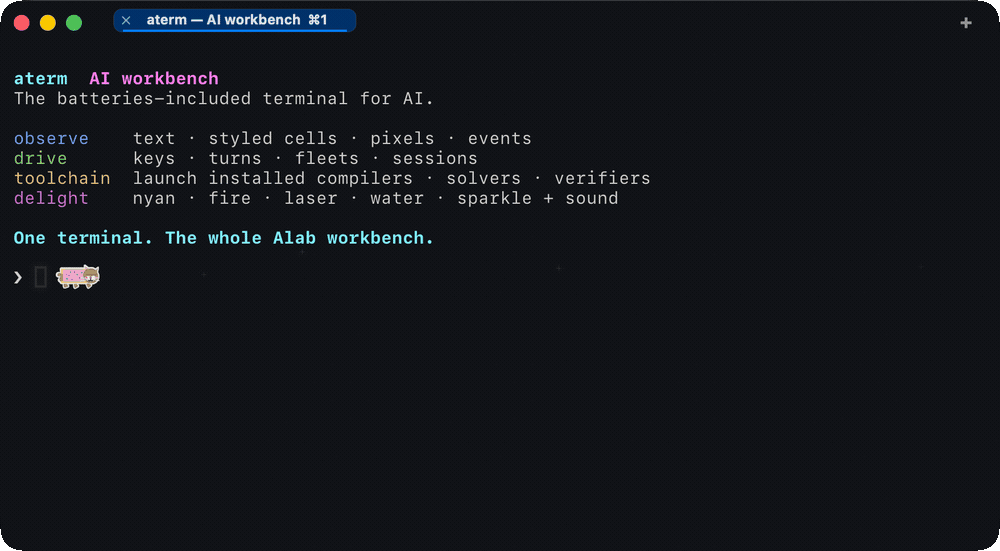
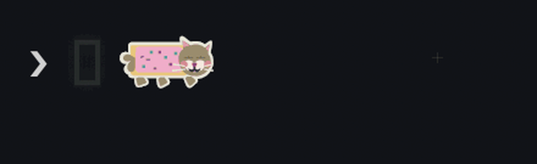
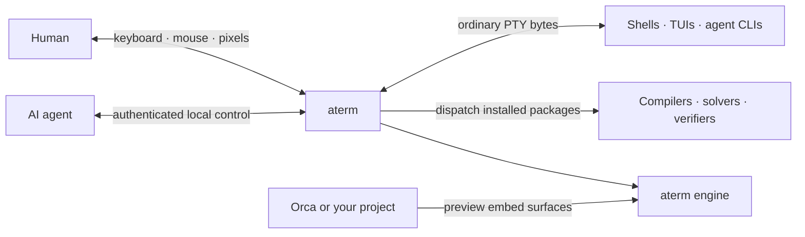

<!-- SPDX-License-Identifier: Apache-2.0 -->
<!-- Copyright 2026 Andrew Yates -->

<h1 align="center">aterm</h1>

<p align="center">
  <strong>The batteries-included terminal for AI.</strong><br>
  Built for agents. Wired to ALab. Fun by default.
</p>

<p align="center">
  <a href="#why-aterm">Why aterm?</a> ·
  <a href="#made-for-humans-and-agents">Humans + agents</a> ·
  <a href="#the-alab-workbench">ALab</a> ·
  <a href="#use-aterm-in-your-own-project">Embed it</a> ·
  <a href="#security-model">Security</a>
</p>

<p align="center">
  <picture>
    <source media="(prefers-reduced-motion: reduce)" srcset="assets/aterm-ai-workbench.png">
    
  </picture>
</p>

> [!IMPORTANT]
> **Source release:** the public aterm series starts at `v0.1.0`. This repository
> contains the buildable product source and authentic product captures for a
> macOS-first preview. It does **not** include a prebuilt binary, installer,
> public updater channel, or bundled ALab tool packages.

## Build from source

The public snapshot pins the stock Rust toolchain used by its publication gate.
On macOS with Xcode Command Line Tools installed:

```sh
git clone https://github.com/alabsystems/aterm.git
cd aterm
cargo build --locked -p aterm
./target/debug/aterm --window
```

Confirm the public version with `./target/debug/aterm --version`; it should print
`aterm 0.1.0`. Build from the workspace rather than using `cargo install`:
aterm's crates are not independently published to crates.io yet. Linux and
Windows code is present, but macOS is the exercised preview target for this
first public source release.

## Why aterm?

Most terminals are excellent human interfaces. aterm keeps that familiar PTY
and adds a second, authenticated surface that software can understand: text,
styled cells, pixels, events, sessions, input, synchronization, and live
metrics.

That makes the terminal a shared workbench. A person can type normally while an
agent observes structured state, drives a turn, waits for a real transition,
or captures the rendered result. Shells, TUIs, REPLs, editors, and agent CLIs
still see an ordinary terminal.

**And it is fun.** Writing software in aterm just feels better. The window looks
alive, the cursor has personality, and the compilers, solvers, and verification
tools installed in the ALab environment are one command away.

| Battery | What aterm adds | Important boundary |
| --- | --- | --- |
| **Observe** | Plain text, lossless styled cells, pixels, terminal modes, shell blocks, and events | Structured control is available in window and headless modes, not the transparent TTY session |
| **Drive** | Text, keys, paste, mouse, focus, resize, selection, and clipboard operations | Signals are a separate out-of-band operation, not simulated human keystrokes |
| **Coordinate** | Event-driven `await`, `ready`, `wait`, and whole-turn settlement | `turn` settles on display quiescence, not arbitrary process completion; `wait` uses OSC-133 command marks |
| **Stream** | `screen`, `cursor`, `cells`, `bytes`, `events`, and `sessions` subscriptions | Resynchronization is explicit through gap markers |
| **Render + record** | PNG frames, bounded asciicast history, opt-in temporal recording, and presented-frame video | Video requires the GPU backend and starts only when requested |
| **Measure** | Live render, frame, input, and output-to-present counters | This README makes no aggregate performance claim |
| **Extend** | Themes, settings, Trail Packs, process control, and Rust/WASM engine source | Workspace path APIs are available, but crates.io packaging and API stability are not |
| **Delight** | Cursor companions, rainbow trails, fire, laser, water, sparkle, and sound | Signature trail sounds are currently a macOS feature |

## Fun is a feature

The current preview defaults to a rainbow cursor cat: a small companion, a
banded rainbow trail, and—on macOS—a matching sound palette. Trail sounds are on
by default, because delight is part of the product rather than an easter egg.

<p align="center">
  
</p>

Switch the cursor to `phaser`, `comet`, `lumen`, `sparkle`, `fire`, `laser`,
`water`, or `beam`; load a custom Trail Pack; or turn on Matrix rain. Each
built-in trail has its own visual character, and the macOS preview pairs the
animated styles with signature droplets, crackle, chimes, or hum.

Hold a key on the rainbow trail and the cat eventually goes full sing-along:
maximal ribbon flow, a dancing singing face, rising music notes, and an original
chiptune riff that crossfades away when you stop. The continuous ambient sound
bed is optional and off by default; keystroke notes and the sing-along remain
part of the default macOS sound experience.

Fun remains controllable. Reduced-motion policy tones down governed animation.
`serious_mode` suppresses decorative effects and their sounds without changing
the terminal's functional behavior, and individual trail and sound settings can
be switched off independently.

## Made for humans and agents

aterm does not make an agent impersonate a person by scraping pixels and hoping
the timing works. Its local control protocol lives outside the PTY byte stream,
while actual text and key input still enter through the same terminal paths used
by a person.



The control-enabled window and headless modes provide:

- **Structured observation:** `text`, `screen`, individual cells and lines,
  cursor state, terminal modes, search, command blocks, and session metadata.
- **Rendered truth:** `image` captures the frame aterm renders. GPU `video`
  records presented frames, including effects that may exist only during
  presentation.
- **Human-style input:** `send`, `key`, mouse, paste, focus, resize, selection,
  and clipboard requests converge on the terminal's input path. Process signals
  remain explicit and out of band.
- **Whole turns:** `turn` types, submits, verifies progress, waits for the screen
  to settle, and returns the visible result plus a deterministic hash. Humans
  can interject between turns.
- **Event-driven synchronization:** `await`, `ready`, `wait`, and `subscribe`
  park on state changes rather than forcing a driver to poll.
- **Session fabric:** stable session IDs, exact `@sid` routing, cooperative
  leases, multi-session subscriptions, and lifecycle events support agent
  fleets without confusing one tab for another.

### CLI tour

After building the workspace, open a window:

```sh
aterm --window
```

From another shell, inspect and drive its active session:

```sh
aterm ctl text                  # plain visible rows
aterm ctl screen                # lossless styled-grid JSON
aterm ctl image frame.png       # a rendered PNG; reply gives the confined path
aterm ctl turn 'git status'     # type, submit, settle, and return the screen
aterm ctl metrics               # live render and latency counters
```

Target one session or subscribe to several structured streams:

```sh
aterm ctl ls
sid=$(aterm ctl ls | awk 'NR == 1 {print $3}')
aterm ctl "@$sid" turn 'make test'
aterm ctl subscribe "@$sid" screen,cursor,cells,bytes,events
```

Socket discovery is automatic for ordinary local use. `--sock`, `--pid`, and
stable `@<sid>` selectors make the target explicit when automation needs that
precision.

## The ALab workbench

At ALab, aterm is bundled throughout the development environment. It is our
front door to the terminal, agent control, package management, and the installed
compilers, solvers, and verification tools used to build software.

The same binary owns package management and managed-tool dispatch. When a tool
is installed in the active ALab channel, these stay under one spelling:

```sh
aterm pkg list
aterm ay --help       # solver
aterm ty --help       # explicit-state specification checker
aterm trust --help    # compiler toolchain
```

That describes ALab's managed environment. The `v0.1.0` source snapshot does
not ship those packages, and tool availability varies by channel and platform.

## Use aterm in your own project

There are two integration shapes in the source release.

### 1. Control a running terminal

Use the authenticated local protocol when your program should share a real PTY
session with a person. Start with the CLI—every result has a protocol-level
equivalent:

```sh
aterm ctl screen
aterm ctl turn 'cargo test'
aterm ctl await screen-changed timeout=5000
```

This is the right boundary for an agent orchestrator, test harness, development
environment, or tool that needs observation and control without owning the
terminal engine.

### 2. Embed the engine

Use the Rust/WASM engine surfaces when your application owns the terminal grid
and renderer. Until the crates are published independently, point your
workspace at the checked-out source:

```toml
[dependencies]
aterm-core = { path = "../aterm/crates/aterm-core" }
```

The current Rust shape is intentionally small:

```rust
use aterm_core::terminal::TerminalBuilder;

let mut terminal = TerminalBuilder::new()
    .size(24, 80) // rows, columns
    .build();

terminal.process(b"\x1b[32mhello from aterm\x1b[0m");
let visible = terminal.visible_content();
assert!(visible.contains("hello from aterm"));
```

[Orca](https://www.onorca.dev/) is the reference product integration. A
[published ALab Edition snapshot](https://github.com/stablyai/orca/blob/73cae6c9df23cc6386847a3d33580a6b1877c423/README.md#rust-and-aterm-terminal-stack)
shows a pinned aterm revision providing Rust terminal state, parsing, search,
selection, scrollback, and CPU/GPU WebAssembly renderers; its
[`orca-terminal` adapter](https://github.com/stablyai/orca/tree/73cae6c9df23cc6386847a3d33580a6b1877c423/rust/crates/orca-terminal)
is a concrete integration example.

That snapshot demonstrates engine integration, not a stable aterm SDK.
Embedding the engine also does not automatically include the native aterm
window, local control socket, or macOS sound palette. The workspace crates are
public in this snapshot, but remain pre-1.0 APIs and are not yet distributed on
crates.io.

## One binary, distinct modes

aterm builds as one executable. Invocation chooses the surface:

| Invocation | Result | External control socket |
| --- | --- | --- |
| `aterm` in a TTY | Transparent PTY session | No |
| `aterm` without a TTY | Terminal window | Yes, by default |
| `aterm --window` | Terminal window, explicitly | Yes, by default |
| `aterm --headless` | Terminal engine without a window | Yes, by default |
| `aterm --session` | Force the PTY session in a pipe or CI | No |

The binary also handles `aterm ctl`, `aterm pkg`, `aterm fleet`, `aterm drive`,
diagnostics, help, and managed-tool dispatch. Compatibility names such as
`aterm-ctl` are symlinks to that binary, not separate products.

The plain TTY session deliberately serves no socket. Use window or headless mode
when another process needs to observe or drive a session. Those modes enable
control by default, but can disable it explicitly and fail closed if a secure
socket cannot be created.

## A real terminal underneath

The engine supports modern shell and TUI workloads, including Unicode grapheme
clusters, emoji sequences, wide and combining characters, terminal keyboard
modes, hyperlinks, shell marks, styled underlines, and 24-bit colour. Box
drawing, blocks, braille, and Powerline separators can be generated from cell
geometry so adjacent shapes meet cleanly.

The window uses wgpu over Metal on macOS, Vulkan on Linux, and DX12 on Windows,
with a CPU renderer as fallback or explicit choice. General glyph parity is
tested with a small channel tolerance. Orthogonal procedural graphics are exact
between CPU and GPU paths; antialiased arcs, diagonals, Powerline shapes, and
wedges use a bounded channel tolerance. Public availability remains a limited
macOS preview.

Tabs, panes, multiple windows, full-buffer search, configurable themes and
typography, and built-in Settings, Markdown, and Editor tabs share the same
terminal host. The event loop parks when there is no work or pending deadline.

## Security model

The control surface can read terminal output and inject input, so aterm treats
it as privileged:

- Every control-enabled window or headless instance uses a fresh per-launch
  capability token.
- Unix runtime directories, sockets, and tokens are user-private, and every
  connection verifies the peer's user ID.
- Windows uses a hardened user-private ACL plus the launch token; SYSTEM and
  platform administrators remain privileged.
- Scoped edge capabilities can grant one operation class against one session
  without disclosing the instance-owner token.
- Network driving is opt-in and uses an authenticated TLS relay; it is not the
  default control path.
- Capture paths are confined to server-managed runtime directories.

`--sandbox` adds the macOS network and secret-directory cage. Linux currently
enforces resource limits plus the capability gate; Windows currently enforces
the capability gate. Both disclose the difference at startup and should not be
assumed to provide the same OS confinement as macOS.

Temporal recording is off by default, and pixel video starts only when
requested. Each session does retain a bounded in-memory asciicast output
history. Granting terminal control grants the ability to act with the authority
of programs running in that session.

Report suspected vulnerabilities through [SECURITY.md](SECURITY.md), never a
public issue.

## Verification and performance evidence

Selected bounded protocols and state machines are authored once as Rust-derived
models. An embedded exhaustive checker always discharges their invariant,
deadlock, prove-and-catch, and transition obligations. When external Trust tools
are installed, the same obligations receive an additional independent check.
Conformance tests project real subsystem state back onto those models so the
specifications stay tied to shipping transitions.

The VT engine is also exercised by conformance, property, fuzz, renderer-parity,
and differential tests. These checks prove or test named, bounded contracts;
they are not a proof of the entire emulator, renderer, operating system, or
every possible input sequence.

Run `cargo run -q -p xtask -- gate counts` for the live proof inventory. Totals
are intentionally computed from source rather than maintained in prose.

This source snapshot makes no aggregate performance claim. A future claim
should ship with a preserved evidence packet identifying the commit and binary,
hardware and operating system, workload, commands, raw results, and comparison
policy. `aterm ctl metrics` exists so render and latency behavior can be measured
on the workload that matters.

## Help and configuration

The executable carries its current command reference:

```sh
aterm --help
aterm --window --help
aterm help introspection
aterm ctl --help
aterm doctor
aterm --window --show-config
aterm --window --validate-config
aterm list-themes
```

Configuration is loaded from `$XDG_CONFIG_HOME/aterm/aterm.toml`, falling back
to `%APPDATA%\aterm\aterm.toml` on Windows and
`~/.config/aterm/aterm.toml` elsewhere. Environment variables and explicit
flags override file settings. The window watches the configuration and applies
supported changes without requiring a restart.

The public snapshot pins stock Rust `1.97.1` and is checked from a fresh,
credential-free clone. The private development line also uses the Trust
compiler and external verification tools; those tools strengthen checks when
present but are not required to build this public source snapshot. There is no
anonymous binary installer or public updater channel yet.

## Community and license

Source contributions are welcome. See [CONTRIBUTING.md](CONTRIBUTING.md) for
the build and review boundary and [SECURITY.md](SECURITY.md) for private
vulnerability reporting.

Unless a file says otherwise, aterm is licensed under the
[Apache License 2.0](LICENSE). MIT-licensed project components use
[LICENSE-MIT](LICENSE-MIT), and bundled or derived third-party material retains
its own terms. See [NOTICE](NOTICE) for the distribution inventory and
[PUBLICATION.md](PUBLICATION.md) for the `v0.1.0` source-snapshot boundary.
